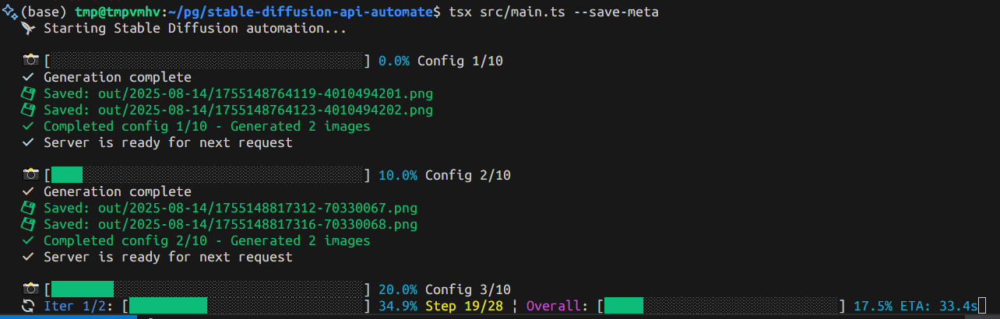
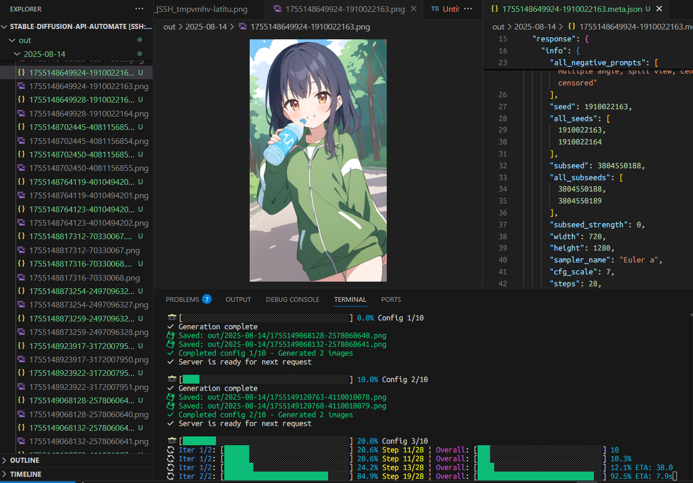

# Stable Diffusion API Automate

A powerful command-line tool for automating Stable Diffusion image generation through the WebUI API. Generate multiple images with different configurations, monitor progress in real-time, and save results with metadata.

## Screenshots

### CLI Interface in Action


The colorized terminal interface showing:
- **Real-time progress bars** with visual feedback
- **Step-by-step generation tracking** 
- **ETA estimates** and completion status
- **Colorized output** for different message types

### Development Environment


The tool integrates well with development environments, showing clean output and easy debugging capabilities.

## Features

- 🚀 **Batch Processing**: Process multiple configurations from a JSONL file
- 📊 **Real-time Progress**: Live progress bars with step-by-step generation tracking
- 🎨 **Colorized Output**: Beautiful terminal interface with chalk-powered colors
- ⌨️ **Graceful Exit**: Press 'z' to safely exit after current generation completes
- 📁 **Organized Output**: Automatic date-based directory organization
- 💾 **Metadata Saving**: Optional JSON metadata files with generation parameters
- 🔧 **Flexible Configuration**: Extensive CLI options for customization
- 📈 **Detailed Logging**: Verbose mode with timestamps and file paths

## Installation

```bash
# Clone or download the project
cd stable-diffusion-api-automate

# Install dependencies
npm install
```

### Prerequisites

1. **Configure environment variables:**

Copy the example environment file and customize it:
```bash
cp .env.example .env
```

Edit `.env` file:
```bash
# Required: Your WebUI API URL
SD_WEBUI_URL=http://192.168.100.105:7860

# Optional: Default paths (can be overridden by CLI options)
# CONFIGS_FILE=prompts/configs.jsonl
# OUTPUT_DIR=out
```

2. **Start Stable Diffusion WebUI with API enabled:**

```bash
# Windows
.\webui.bat --listen --api

# Linux/Mac
./webui.sh --listen --api
```

The `--listen` flag allows external connections, and `--api` enables the API endpoints required by this tool.

For more detailed API documentation, see: https://github.com/AUTOMATIC1111/stable-diffusion-webui/wiki/API

## Quick Start

1. **Prepare your configuration file** (`prompts/configs.jsonl`):
```jsonl
{"prompt": "1girl, solo, green tracksuit, black hair, brown eyes, mischievous smile", "negative_prompt": "worst quality, bad quality", "width": 720, "height": 1280, "sampler_name": "Euler a", "steps": 28, "cfg_scale": 7, "seed": -1, "batch_size": 1, "n_iter": 2, "hires_fix": false}
{"prompt": "1girl, solo, red dress, blonde hair, blue eyes, gentle smile", "negative_prompt": "worst quality, bad quality", "width": 720, "height": 1280, "sampler_name": "Euler a", "steps": 28, "cfg_scale": 7, "seed": -1, "batch_size": 1, "n_iter": 1, "hires_fix": false}
```

2. **Run the tool**:
```bash
npm start
```

3. **Monitor progress** and press 'z' if you need to stop gracefully.

## Usage

### Basic Commands

```bash
# Run with default settings
npm start

# Show help
npm run help

# Run with verbose logging
npm start -- -v

# Use custom config file and output directory
npm start -- --configs-file custom.jsonl --output-dir ./my-images

# Save metadata files
npm start -- --save-meta

# Quiet mode (no config logging)
npm start -- --disable-log-config
```

### CLI Options

| Option | Description | Default |
|--------|-------------|---------|
| `--configs-file <path>` | Path to configs JSONL file | From `.env` or `prompts/configs.jsonl` |
| `--output-dir <path>` | Output directory for images | From `.env` or `out` |
| `--base-url <url>` | WebUI API base URL | From `.env` or `http://localhost:7860` |
| `--save-meta` | Save metadata JSON files | `false` |
| `--disable-log-config` | Disable configuration logging | `false` |
| `-v, --verbose` | Enable verbose logging | `false` |
| `-h, --help` | Display help information | - |

### Keyboard Controls

- **'z' or 'Z'**: Graceful exit (completes current generation then stops)
- **Ctrl+C**: Force exit (immediate termination)

## Environment Configuration

The tool uses environment variables for configuration. Create a `.env` file in the project root:

```bash
# Required: WebUI API URL
SD_WEBUI_URL=http://localhost:7860

# Optional: Default file paths
CONFIGS_FILE=prompts/configs.jsonl
OUTPUT_DIR=out
```

### Configuration Priority

Settings are applied in this order (highest to lowest priority):
1. **Command-line arguments** (e.g., `--base-url http://localhost:8080`)
2. **Environment variables** (from `.env` file)
3. **Default values**

### Common WebUI URL Examples

```bash
# Local WebUI (default port)
SD_WEBUI_URL=http://localhost:7860

# Local WebUI with custom port
SD_WEBUI_URL=http://localhost:8080

# Remote WebUI on local network
SD_WEBUI_URL=http://192.168.1.100:7860

# Remote WebUI with custom port
SD_WEBUI_URL=http://192.168.1.100:8080
```

## Configuration File Format

The configuration file should be in JSONL (JSON Lines) format, with each line containing a complete Stable Diffusion API payload:

```jsonl
{
  "prompt": "your positive prompt here",
  "negative_prompt": "your negative prompt here", 
  "width": 720,
  "height": 1280,
  "sampler_name": "Euler a",
  "steps": 28,
  "cfg_scale": 7,
  "seed": -1,
  "batch_size": 1,
  "n_iter": 2,
  "hires_fix": false
}
```

### Supported Parameters

All standard Stable Diffusion WebUI API parameters are supported:
- `prompt` - Positive prompt text
- `negative_prompt` - Negative prompt text  
- `width`, `height` - Image dimensions
- `sampler_name` - Sampling method
- `steps` - Number of sampling steps
- `cfg_scale` - CFG scale value
- `seed` - Random seed (-1 for random)
- `batch_size` - Number of images per batch
- `n_iter` - Number of iterations
- `hires_fix` - Enable high-resolution fix
- And many more...

## Progress Monitoring

The tool provides detailed real-time progress information:

### Single Iteration Display
```
🔄 [████████████████░░░░░░░░░░░░░░] 57.1% Step 16/28 ETA: 12.3s
```

### Multiple Iterations Display  
```
🔄 Iter 1/2: [████████████████░░░░░░░░░░░░░░] 57.1% Step 16/28 | Overall: [████████░░░░░░░░░░░░░░░░░░░░] 28.6% ETA: 25.1s
```

### Overall Progress
```
📸 [████████████░░░░░░░░░░░░░░░░░░░░░░░░░░░░] 30.0% Config 3/10
```

## Output Structure

Generated files are organized by date:

```
out/
└── 2025-08-14/
    ├── 1723648392847-2605429855.png
    ├── 1723648392847-2605429855.meta.json (if --save-meta)
    ├── 1723648394123-2605429856.png
    └── 1723648394123-2605429856.meta.json (if --save-meta)
```

### File Naming Convention

Images are named using the format: `[timestamp]-[seed].png`
- `timestamp`: Unix timestamp when the image was generated
- `seed`: Actual seed used for generation (from API response)

### Metadata Files

When `--save-meta` is enabled, each image gets an accompanying `.meta.json` file containing:

```json
{
  "config": {
    "prompt": "...",
    "negative_prompt": "...",
    "width": 720,
    // ... full generation parameters
  },
  "response": {
    "info": {
      "seed": 2605429855,
      // ... API response metadata
    },
    "timestamp": "2025-08-14T12:34:56.789Z",
    "filename": "1723648392847-2605429855.png",
    "seed": 2605429855
  }
}
```

## Server Requirements

- Stable Diffusion WebUI running with `--listen --api` flags
- WebUI endpoint configured in `.env` file (see Environment Configuration section)
- WebUI must be accessible from the machine running this tool

To start WebUI with API:
```bash
# Windows
.\webui.bat --listen --api

# Linux/Mac
./webui.sh --listen --api
```

**Important:** Both `--listen` and `--api` flags are required:
- `--listen`: Allows connections from other machines
- `--api`: Enables REST API endpoints

For comprehensive API documentation and advanced configuration options, visit:  
https://github.com/AUTOMATIC1111/stable-diffusion-webui/wiki/API

## Troubleshooting

### Connection Issues
- Ensure WebUI is running with `--api` flag
- Check if the server IP/port is correct (default: `192.168.100.105:7860`)
- Verify firewall settings allow connections

### Progress Not Updating
- The tool automatically monitors `/sdapi/v1/progress` endpoint
- If progress seems stuck, the server might be overloaded
- Try reducing `n_iter` or `batch_size` values

### Generation Fails
- Check WebUI console for error messages
- Verify your prompts don't contain invalid characters
- Ensure model is loaded in WebUI

### Graceful Exit Not Working
- Make sure terminal supports raw mode input
- Try pressing 'z' multiple times
- Use Ctrl+C as last resort (may not save current generation)

## Examples

### Basic Usage
```bash
# Generate images with default settings
npm start
```

### Advanced Usage
```bash
# Custom configuration with metadata saving
npm start -- \
  --configs-file ./my-prompts.jsonl \
  --output-dir ./renders \
  --save-meta \
  --verbose
```

### Quiet Mode
```bash
# Minimal output, no config logging
npm start -- --disable-log-config
```

## Contributing

1. Fork the repository
2. Create a feature branch
3. Make your changes
4. Test thoroughly
5. Submit a pull request

## License

MIT License - feel free to use and modify as needed.

